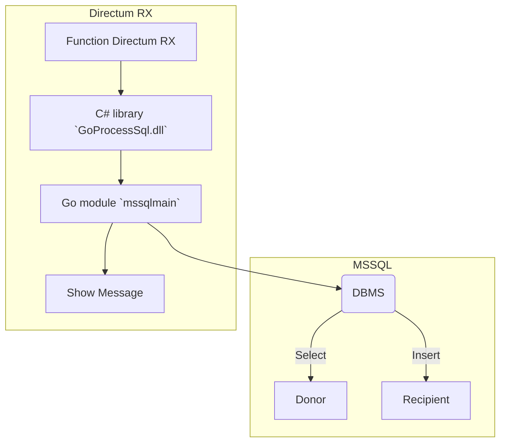

### sqlbulk2dirx
### Ru

Демо пакеты модуля "прослушиватель" данных очереди RabbitMQ.   
Если наши данные появились в очереди, вызывается метод Directum RX через сформированную гиперссылку Hyperlink.    
Интеграционный метод обработчика, который выполняется при переходе по гиперссылке, должен существовать в Directum RX.  

Для прослушивания сообщений, запустить модуль:    
 
	listen2rabbit4dirx  

Демо модуль для публикаций сообщений (SAP_A, SAP_B, SAP_C) в очередь:    
 
	publisher2listener SAP_A

***Схема обмена данными между Go-пакетами (scheme exchange of data between Go-packets):***
			

### En

Demo packages of RabbitMQ queue data "listener" module.  
If our data is in the queue, the Directum RX method is called via the generated Hyperlink.  
Handler method of integration, while executed when a hyperlink is followed must exist in Directum RX.     

To listen messages, run the module:  
 
	listen2rabbit4dirx

Demo module for publishing messages (SAP_A, SAP_B, SAP_C) to to a queue:  
 
	publisher2listener SAP_A
