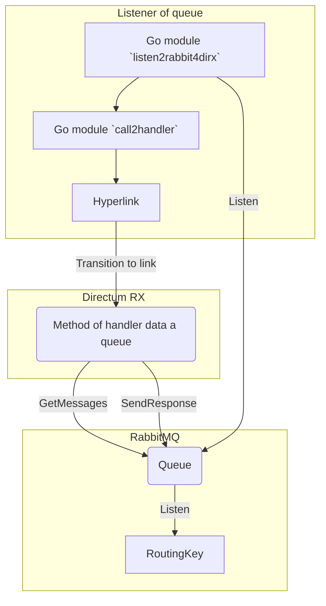

### listen2rabbit
### Ru

Демо пакеты go-модуля "прослушивателя" `listen2rabbit4dirx` данных в очереди RabbitMQ.   
Если данные появились в нашей очереди, go-модулем `call2handler`, вызывается метод обработчика Directum RX, через сформированную гиперссылку `Hyperlink`.    
Интеграционный метод обработчика, который выполняется при переходе по гиперссылке, должен существовать в Directum RX.  

Для прослушивания сообщений, запустить модуль:    
 
	listen2rabbit4dirx  

Демо модуль для публикаций сообщений (`SAP_A, SAP_B, SAP_C`) в очереди:    
 
	publisher2listener SAP_A

***Схема обмена данными (scheme exchange of data):***
			

### En

Demo packages of module `listen2rabbit4dirx` it "listener" of RabbitMQ queue data.    
If data appeared in the our queue, the Directum RX method of handler is called the generated `Hyperlink`, via go module `call2handler`.   
Handler method of integration, while executed when a hyperlink is followed must exist in Directum RX.       

To listen messages, run the module:  
 
	listen2rabbit4dirx

Demo module for publishing messages (`SAP_A, SAP_B, SAP_C`) to to a queue:  
 
	publisher2listener SAP_A
