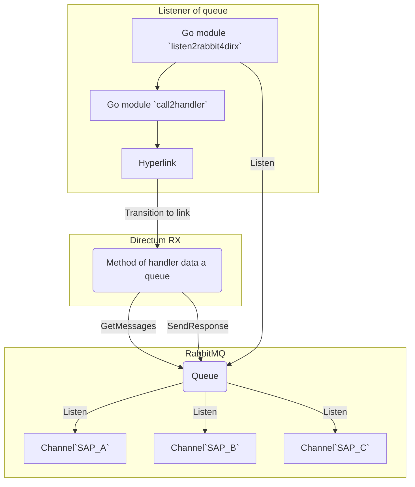

### Ru

Демо модуль "прослушивателя" `listen2rabbit4dirx` каналов данных очереди `RabbitMQ`. Поддерживает `TLS`.
Если данные появились в нашей очереди, go-модулем `call2handler`, вызывается метод обработчика `Directum RX`, через сформированную гиперссылку `Hyperlink`.    
Интеграционный метод обработчика, который выполняется при переходе по гиперссылке, должен существовать в `Directum RX`.  

Для прослушивания сообщений в каналах, запустить модуль:    
 
	listen2rabbit4dirx  

Демо модуль для публикаций сообщений в каналах (`SAP_A, SAP_B, SAP_C`) очереди:    
 
	publisher2listener SAP_A

***Схема обмена данными (scheme exchange of data):***
			

### En

Demo module `listen2rabbit4dirx` it "listener" to channels of queue data  of `RabbitMQ`. Supports `TLS`.     
If data appeared in the our queue, the `Directum RX` method of handler is called the generated `Hyperlink`, via go module `call2handler`.   
Handler method of integration, while executed when a hyperlink is followed must exist in `Directum RX`.       

To listenning messages in channels, run the module:  
 
	listen2rabbit4dirx

Demo module for publishing messages in channels (`SAP_A, SAP_B, SAP_C`) of a queue: 
 
	publisher2listener SAP_A
